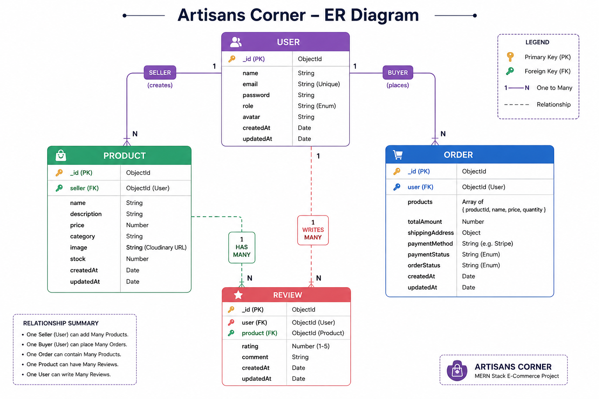

# Artisans Corner

Artisans Corner is a full-stack MERN marketplace application where sellers can add and manage products, while buyers can browse products, add items to their cart, place orders, and submit reviews.

## Features

* User Registration and Login
* JWT Authentication
* Buyer, Seller, and Admin Roles
* Add, Edit, and Delete Products
* Cloudinary Image Upload
* Product Listing and Product Details
* Shopping Cart
* Wishlist
* Checkout and Shipping Address
* Order Management
* Product Reviews
* Seller Dashboard
* Admin Dashboard

## Tech Stack

### Frontend

* React.js
* React Router
* Axios
* React Toastify
* Context API

### Backend

* Node.js
* Express.js
* MongoDB Atlas
* Mongoose
* JWT
* bcrypt.js
* Cloudinary

## Database Schema



## Demo Credentials

### Demo Buyer

* Email: kashyappayal654@gmail.com
* Password: 56778

### Demo Vendor / Seller

* Email: abc@gmail.com
* Password:678990

## Installation

### Clone the Repository

```bash
git clone YOUR_REPOSITORY_URL
cd "Artisans Corner"
```

### Install Backend Dependencies

```bash
cd server
npm install
npm start
```

### Install Frontend Dependencies

```bash
cd client
npm install
npm run dev
```

## Environment Variables


```env
PORT=5000
MONGO_URI=your_mongodb_connection_string
JWT_SECRET=your_jwt_secret
CLOUDINARY_CLOUD_NAME=your_cloud_name
CLOUDINARY_API_KEY=your_api_key
CLOUDINARY_API_SECRET=your_api_secret
```


## Author

Payal
